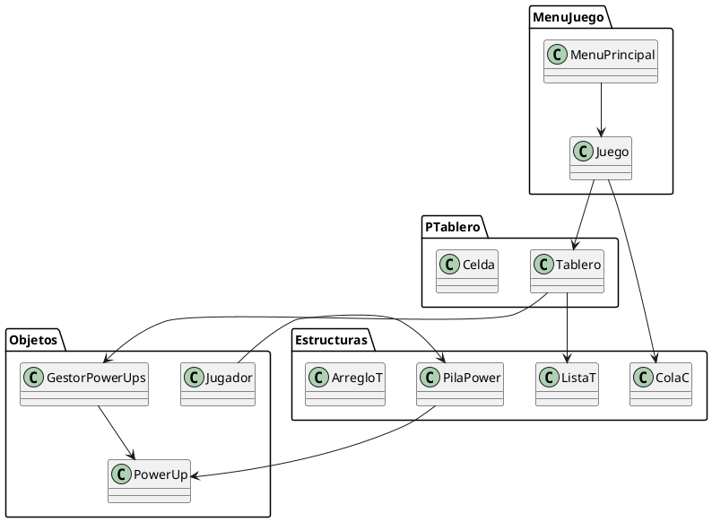
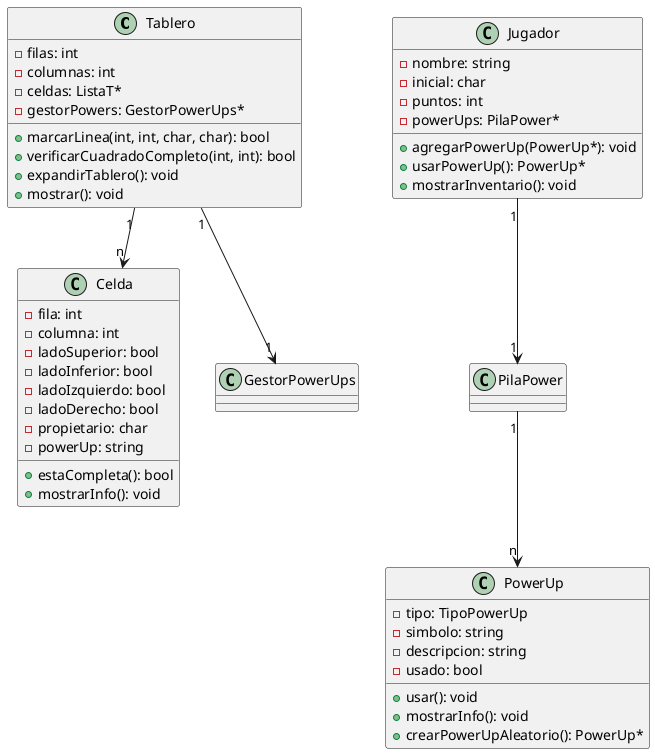
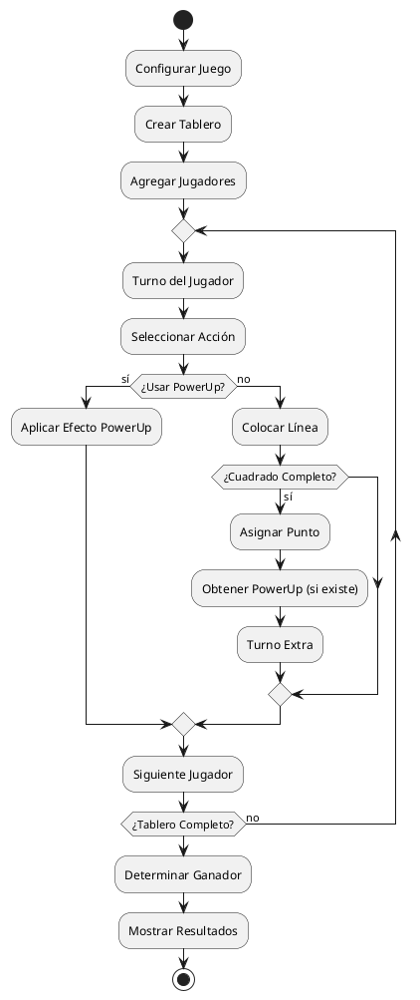
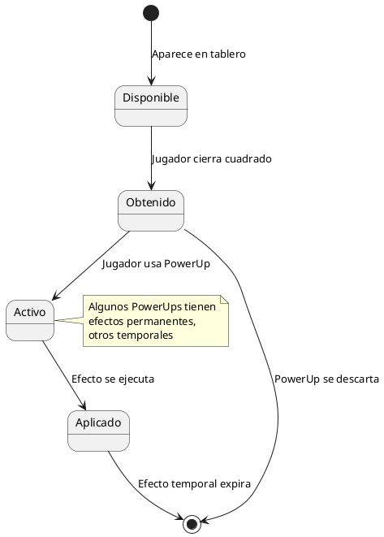
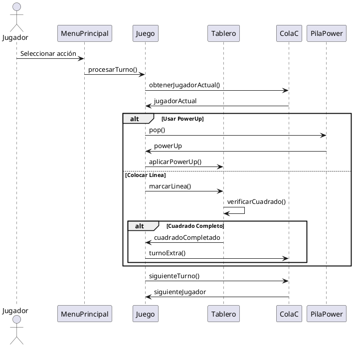

# Manual Técnico - Totito Chino / Cajas

## Tabla de Contenidos
1. [Introducción](#introducción)
2. [Arquitectura del Sistema](#arquitectura-del-sistema)
3. [Estructuras de Datos](#estructuras-de-datos)
4. [Diagramas del Sistema](#diagramas-del-sistema)
5. [Módulos del Sistema](#módulos-del-sistema)
6. [Mecánicas de Juego](#mecánicas-de-juego)
7. [Sistema de PowerUps](#sistema-de-powerups)
8. [Compilación y Ejecución](#compilación-y-ejecución)
9. [Consideraciones Técnicas](#consideraciones-técnicas)

## Introducción

Este proyecto implementa el juego **Totito Chino** (también conocido como Timbiriche o Dots and Boxes) en C++, utilizando estructuras de datos implementadas desde cero. El juego permite múltiples jugadores que se turnan para colocar líneas entre puntos adyacentes en un tablero, con el objetivo de cerrar cuadrados y obtener puntos.

### Características Principales
- Tablero dinámico configurable (mínimo 3x3)
- Sistema de turnos con cola circular
- Sistema de PowerUps con efectos especiales
- Gestión automática de memoria
- Interfaz de consola interactiva

## Arquitectura del Sistema

El sistema está organizado en módulos que separan las responsabilidades:



## Estructuras de Datos

### ArregloT<T> - Arreglo Dinámico Genérico
Implementación de un arreglo dinámico con gestión automática de memoria.

**Archivos:** `Estructuras/ArregloT.h`, `Estructuras/ArregloT.tpp`

**Características:**
- Redimensionamiento automático
- Acceso por índice con validación
- Gestión de memoria segura

**Métodos principales:**
```cpp
void insertar(T elemento);
T obtener(int indice);
void redimensionar(int nuevoTamano);
int obtenerTamano();
```

### ListaT - Lista Enlazada Simple
Lista enlazada para almacenar las celdas del tablero.

**Archivos:** `Estructuras/ListaT.h`, `Estructuras/ListaT.cpp`

**Características:**
- Inserción y eliminación eficiente
- Recorrido secuencial
- Gestión automática de nodos

**Métodos principales:**
```cpp
void insertar(Celda* celda);
Celda* buscar(int fila, int columna);
void eliminar(int fila, int columna);
void mostrar();
```

### ColaC - Cola Circular
Gestiona los turnos de los jugadores de forma circular.

**Archivos:** `Estructuras/ColaC.h`, `Estructuras/ColaC.cpp`

**Características:**
- Rotación automática de elementos
- Soporte para turnos extra
- Modificación dinámica del orden

**Métodos principales:**
```cpp
void agregar(Jugador* jugador);
Jugador* siguienteTurno();
void moverAlFinal(Jugador* jugador);
void moverAlFrente(Jugador* jugador);
```

### PilaPower - Pila de PowerUps
Almacena los PowerUps de cada jugador siguiendo la política LIFO.

**Archivos:** `Estructuras/PilaPower.h`, `Estructuras/PilaPower.cpp`

**Características:**
- Acceso LIFO (Last In, First Out)
- Gestión de PowerUps activos
- Validación de disponibilidad

**Métodos principales:**
```cpp
void push(PowerUp* powerUp);
PowerUp* pop();
PowerUp* top();
bool estaVacia();
```

## Diagramas del Sistema

### Diagrama de Clases Principal



### Diagrama de Flujo del Juego



### Diagrama de Estados de PowerUps



### Diagrama de Secuencia - Turno de Jugador



## Módulos del Sistema

### MenuJuego
**Responsabilidades:**
- Configuración inicial del juego
- Gestión de la interfaz principal
- Coordinación entre componentes

**Clases principales:**
- `MenuPrincipal`: Maneja la interfaz y configuración
- `Juego`: Controla la lógica principal del juego

**Funcionalidades:**
- Configuración del tamaño del tablero
- Registro de jugadores
- Control del flujo del juego
- Manejo de entrada del usuario

### PTablero
**Responsabilidades:**
- Representación y gestión del tablero
- Validación de movimientos
- Detección de cuadrados completos

**Clases principales:**
- `Tablero`: Gestiona el tablero completo
- `Celda`: Representa cada celda individual

**Funcionalidades:**
- Renderizado visual del tablero
- Validación de líneas válidas
- Detección automática de cuadrados
- Expansión dinámica del tablero

### Objetos
**Responsabilidades:**
- Gestión de jugadores y PowerUps
- Aplicación de efectos especiales

**Clases principales:**
- `Jugador`: Representa un jugador
- `PowerUp`: Implementa los PowerUps
- `GestorPowerUps`: Gestiona efectos activos

**Funcionalidades:**
- Inventario de PowerUps por jugador
- Aplicación de efectos temporales
- Gestión de puntuación
- Control de estados especiales

## Mecánicas de Juego

### Sistema de Turnos
Implementado con `ColaC`, permite:
- Rotación automática de jugadores
- Turnos extra por cuadrados completados
- Modificación del orden por PowerUps

**Algoritmo básico:**
1. Obtener jugador actual de la cola
2. Procesar acción del jugador
3. Verificar si merece turno extra
4. Rotar al siguiente jugador

### Detección de Cuadrados
El método `verificarCuadradoCompleto` verifica:
1. Estado de los 4 lados de cada celda
2. Asignación de propietario
3. Obtención de PowerUps disponibles

**Condiciones para completar:**
```cpp
bool estaCompleta() {
    return ladoSuperior && ladoInferior && 
           ladoIzquierdo && ladoDerecho;
}
```

### Expansión del Tablero
El PowerUp "Nuevas Tierras" permite expandir dinámicamente el tablero:
- Redimensiona la estructura de celdas
- Redistribuye PowerUps existentes
- Mantiene el estado actual del juego

## Sistema de PowerUps

### Tipos de PowerUps

| Símbolo | Nombre | Efecto | Duración |
|---------|--------|--------|----------|
| DL | Doble Línea | Permite colocar dos líneas consecutivas | Inmediato |
| TS | Trampa Secreta | Línea que roba puntos al enemigo | Hasta activación |
| BL | Bloqueo | Bloquea una línea durante una ronda | Una ronda |
| PS | Pase | Pasa turno y va al final de la cola | Inmediato |
| LS | Llave Secreta | Ignora un bloqueo existente | Un uso |
| ES | Escurridizo | Protege contra trampas | Un uso |
| UF | Unión a Futuro | Doble punto si el mismo jugador completa después | Permanente |
| AC | A Qué Costo | Punto para quien corresponde, casilla para quien puso línea | Hasta activación |
| NT | Nuevas Tierras | Expande el tablero | Inmediato |
| EX | Explosivos | Elimina un punto del mapa | Inmediato |

### Gestión de Efectos
La clase `GestorPowerUps` mantiene:
- Lista de efectos activos
- Control de duración temporal
- Verificación de condiciones especiales

**Estados de PowerUp:**
1. **Disponible**: Visible en el tablero
2. **Obtenido**: En inventario del jugador
3. **Activo**: Efecto aplicado
4. **Usado**: Efecto consumido

### Interacciones Entre PowerUps

**Prioridades de efectos:**
1. Llave Secreta > Bloqueo
2. Escurridizo > Trampa Secreta
3. Explosivos afecta a todos los demás
4. Nuevas Tierras redistribuye PowerUps existentes

## Compilación y Ejecución

### Requisitos del Sistema
- **Compilador**: C++20 compatible (GCC 10+, Clang 12+)
- **Build System**: CMake 3.30 o superior
- **SO**: Linux/Unix (desarrollado en Ubuntu)
- **Memoria**: Mínimo 512MB RAM
- **Terminal**: Soporte para caracteres UTF-8

### Proceso de Compilación

#### Usando CMake (Recomendado)
```bash
# Crear directorio de build
mkdir build && cd build

# Configurar proyecto
cmake ..

# Compilar
make -j$(nproc)

# Ejecutar
./Practica1Edd
```

#### Compilación Manual
```bash
g++ -std=c++20 -Wall -Wextra -O2 \
    main.cpp \
    Estructuras/*.cpp \
    MenuJuego/*.cpp \
    Objetos/*.cpp \
    PTablero/*.cpp \
    -o Practica1Edd
```

### Estructura de Archivos del Proyecto
```
Practica1_eddSS2025_elmermiguel/
├── main.cpp                 # Punto de entrada principal
├── CMakeLists.txt          # Configuración de CMake
├── Estructuras/            # Estructuras de datos fundamentales
│   ├── ArregloT.h         # Template de arreglo dinámico
│   ├── ArregloT.tpp       # Implementación del template
│   ├── ListaT.h/.cpp      # Lista enlazada simple
│   ├── ColaC.h/.cpp       # Cola circular
│   └── PilaPower.h/.cpp   # Pila de PowerUps
├── MenuJuego/              # Interfaz y control del juego
│   ├── MenuPrincipal.h/.cpp
│   └── Juego.h/.cpp
├── Objetos/                # Entidades del juego
│   ├── Jugador.h/.cpp
│   ├── PowerUp.h/.cpp
│   └── GestorPowerUps.h/.cpp
├── PTablero/               # Lógica del tablero
│   ├── Tablero.h/.cpp
│   └── Celda.h/.cpp
├── Manuales/               # Documentación
│   └── Tecnico.md         # Manual técnico
└── Edd_doc/               # Documentación del proyecto
    └── 00Practica1.md     # Especificaciones
```

### Configuración de Desarrollo

#### VS Code
```json
// .vscode/tasks.json
{
    "version": "2.0.0",
    "tasks": [
        {
            "type": "shell",
            "label": "Build Debug",
            "command": "mkdir -p build && cd build && cmake -DCMAKE_BUILD_TYPE=Debug .. && make",
            "group": "build"
        }
    ]
}
```

#### CLion
El proyecto incluye `CMakeLists.txt` compatible con CLion para desarrollo integrado.

## Consideraciones Técnicas

### Gestión de Memoria

#### Principios Aplicados
- **RAII**: Resource Acquisition Is Initialization
- **Regla de los 3**: Constructor de copia, operador de asignación, destructor
- **Liberación explícita**: Uso consistente de `new`/`delete`

#### Ejemplo de Gestión Segura
```cpp
class ListaT {
private:
    Nodo* cabeza;
    
public:
    // Constructor
    ListaT() : cabeza(nullptr) {}
    
    // Destructor - libera toda la memoria
    ~ListaT() {
        while (cabeza != nullptr) {
            Nodo* temp = cabeza;
            cabeza = cabeza->siguiente;
            delete temp;
        }
    }
    
    // Constructor de copia
    ListaT(const ListaT& otra) {
        // Implementación de copia profunda
    }
};
```

### Validaciones y Manejo de Errores

#### Tipos de Validación
1. **Validación de entrada**: Verificar rangos y formatos
2. **Validación de estado**: Comprobar precondiciones
3. **Validación de memoria**: Verificar punteros válidos

#### Estrategias de Error
```cpp
bool Tablero::marcarLinea(int fila, int columna, char lado, char jugador) {
    // Validar rangos
    if (fila < 0 || fila >= filas || columna < 0 || columna >= columnas) {
        return false;
    }
    
    // Validar lado válido
    if (lado != 'S' && lado != 'I' && lado != 'D' && lado != 'L') {
        return false;
    }
    
    // Continuar con la lógica...
    return true;
}
```

### Optimizaciones de Rendimiento

#### Acceso a Datos
- **Lista enlazada**: Para estructuras dinámicas frecuentemente modificadas
- **Acceso directo**: Para operaciones de búsqueda frecuentes
- **Cache locality**: Mantener datos relacionados juntos

#### Gestión de PowerUps
- **Pool de objetos**: Reutilizar instancias de PowerUp
- **Estados lazy**: Calcular efectos solo cuando es necesario
- **Cleanup automático**: Remover efectos expirados

### Extensibilidad del Sistema

#### Agregar Nuevos PowerUps
1. Definir nuevo tipo en enumeración
2. Implementar lógica en `PowerUp::usar()`
3. Agregar manejo en `GestorPowerUps`
4. Actualizar visualización en `Tablero`

#### Modificar Reglas del Juego
- **Sistema modular**: Cada regla en su propia función
- **Configuración externa**: Parámetros ajustables
- **Hooks de eventos**: Puntos de extensión definidos

### Debugging y Mantenimiento

#### Herramientas Recomendadas
- **Valgrind**: Para detección de memory leaks
- **GDB**: Para debugging paso a paso
- **AddressSanitizer**: Para detección de errores de memoria

#### Logging del Sistema
```cpp
#ifdef DEBUG
    #define LOG(msg) std::cout << "[DEBUG] " << msg << std::endl
#else
    #define LOG(msg)
#endif
```

### Consideraciones de Portabilidad

#### Compatibilidad
- **C++20 Standard**: Uso de características estándar
- **Headers system**: Includes compatibles multiplataforma
- **Terminal handling**: Caracteres ASCII básicos

#### Limitaciones Conocidas
- Interfaz optimizada para terminales Unix/Linux
- Dependencia de caracteres Unicode para visualización
- Tamaño mínimo de terminal recomendado: 80x24

---

*Este manual técnico documenta la implementación completa del juego Totito Chino desarrollado como práctica de Estructuras de Datos. Para consultas específicas sobre implementación, revisar el código fuente en los módulos correspondientes.*

**Fecha de última actualización:** 27 de agosto de 2025  
**Versión del manual:** 1.0  
**Autor:** ElmerMiguel
